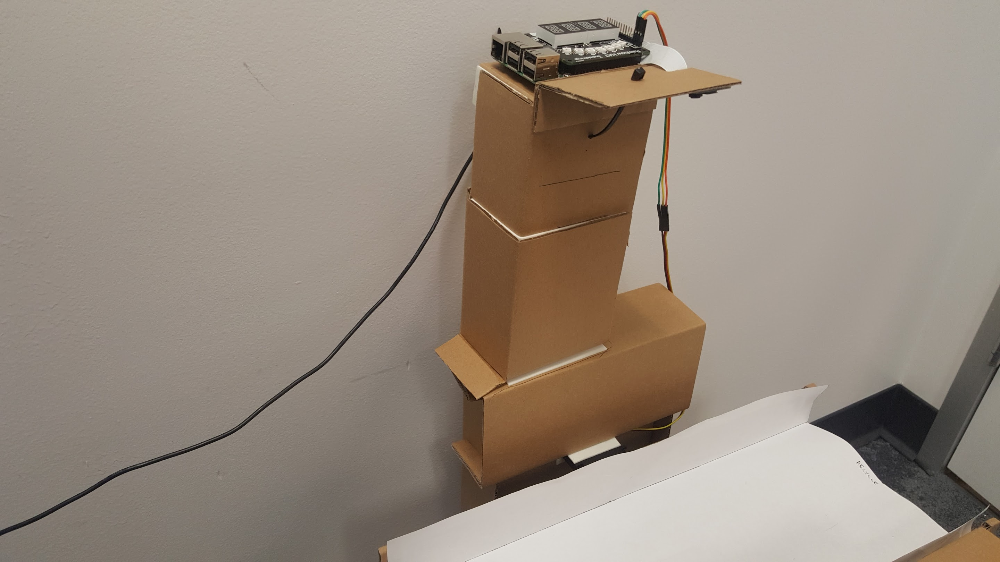
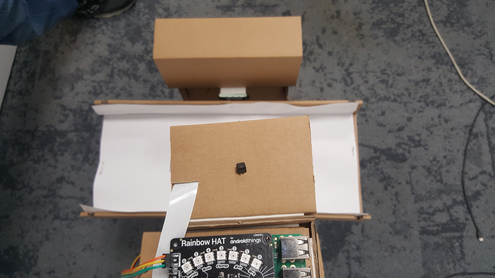
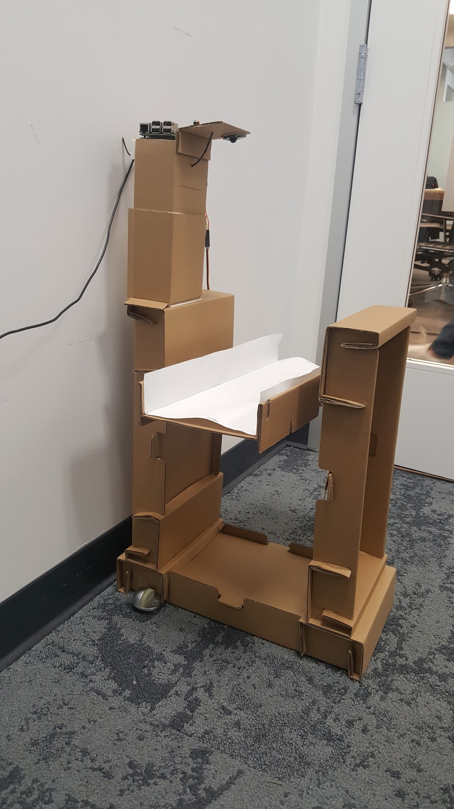
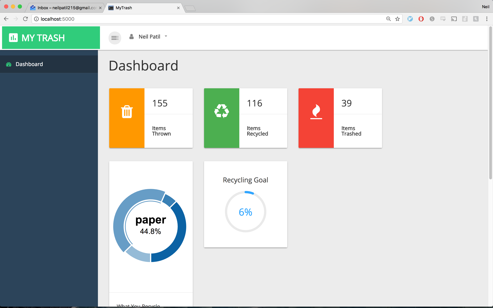

# ScrapSort

Recycling can be a pain. Whether through ignorance or indifference, people often place items in the wrong bins. If a recyclable item ends up in the trash, it often gets sent straight to a landfill without the trash being verified first.

I built a classifier that uses computer vision to determine if a piece of trash is recyclable or not. This classifier then powers a hardware device I built that swings around to dump the trash in the right spot.

## Trash Classification Algorithm

Initially, when prototyping the classifier, I used the Google Cloud Vision API, which allows you to upload and image and receive a list of labels (with confidence values) of the content of that image. The algorithm could then see if any of these labels matched common recyclable materials like "paper", "cardboard", and so on.

However, Cloud Vision turned out to not be as accurate as desired. This is most likely due to the fact that the GCV API is a general-purpose API designed to distinguish thousands of different possible objects in many different contexts. For this project, we wanted the opposite. We only needed to decide whether a piece of trash was recyclable or not (and maybe the type of material of the trash) and the context was always going to be the same - the hardware of the device. Thus, I decided to go with modifying my own neural network architecture.

The classification algorithm I settled on was a modified convolutional neural network that we trained on our own custom data. Specifically, I used the Inception-v3 architecture, but retrained the final layer on our own training set and labels. This training set consisted of pictures we took ourselves as well as other training sets of garbage vs recyclable items we found online. The labels I trained on were common recyclable materials, specifically:

* Metal
* Paper
* Cardboard
* Glass
* Plastic

Thus, if the confidence in any one of those labels was greater than a given threshold, we knew that the item was recyclable.

This allowed me to take advantage of the robust Inception-V3 architecture that I could take advantage of the robustness of Inception-V3 while also training it specifically for my desired context.

I used the tensorflow library to train the model.

Special thanks to [this paper](http://cs229.stanford.edu/proj2016/report/ThungYang-ClassificationOfTrashForRecyclabilityStatus-report.pdf), which provided some of the dataset and advice on the model I used.

## The Device

The device consists of a Raspberry Pi 3 connected to a camera module. This camera points down towards a tray which has servo motors at the pivots. Trash is placed on this tray, which triggers motion detection on the camera. Depending on what the camera sees, the Pi can use the servo motors to orient the tray and have the trash slide into the right bin. The Raspberry Pi uses Python for all hardware interfacing and classification logic.

A few pictures:

## Dashboard

When the device sorts a piece of trash, it sends a copy of the picture and information about what it classified that trash as to a Firebase database. I built a dashboard that pulls data from this database and allows you to view a few interesting statistics about your trash. I might extend this in the future to make the device more of a "smart" trash can.

A screenshot:

## Future Plans

* This preliminary hardware was prototyped in roughly three hours. Thus, I'd ideally like to make the device more of a solid trash can.

* While the trash classification works reasonably well, I'd like to improve it by perhaps exploring other architectures or adding more training data - I think with a little bit more effort I could develop a fairly solid classification algorithm.

* I'd also like to integrate other sensors such as weight to help classify.

This project was created for Greylock Hackfest 2017.
